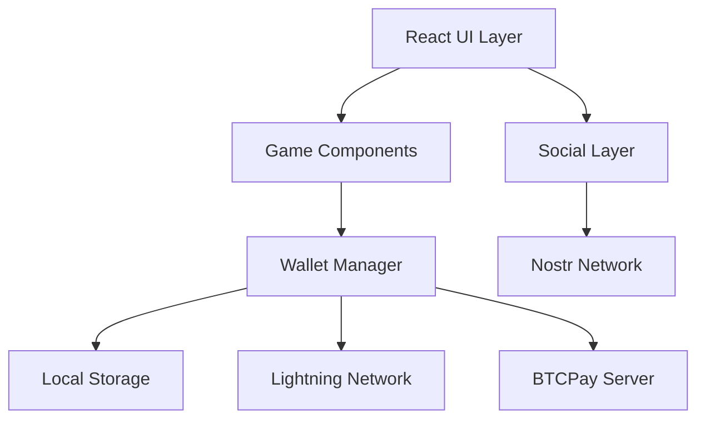

# Island Bitcoin - Architecture Documentation

## System Overview

Island Bitcoin is a Lightning-enabled gaming platform that combines Bitcoin education with real monetary rewards. The architecture prioritizes security, performance, and user experience while handling real-value transactions.



## Core Architecture Principles

### 1. Separation of Concerns
- **UI Layer**: React components handle presentation
- **Business Logic**: Custom hooks encapsulate game and wallet logic
- **Data Layer**: Services manage storage and external APIs
- **Network Layer**: Dedicated clients for Lightning, Nostr, and BTCPay

### 2. Security First
- No private keys stored
- All sensitive data encrypted
- Input validation at every layer
- Rate limiting on game actions
- Admin-only configuration access

### 3. Performance Optimization
- Code splitting for large components
- React.memo for expensive renders
- Lazy loading of game assets
- Efficient Nostr query batching
- Local caching of game state

## Component Architecture

### Directory Structure
```
src/
├── components/         # UI Components
│   ├── games/         # Game-specific components
│   ├── social/        # Nostr social features
│   ├── financial/     # Payment/wallet UI
│   ├── admin/         # Admin panel components
│   ├── common/        # Shared components
│   ├── ui/            # Base UI components (shadcn)
│   └── lazy/          # Code-split components
├── hooks/             # Custom React hooks
├── lib/               # Business logic & utilities
│   └── wallet/        # Wallet service modules
├── pages/             # Route components
└── contexts/          # React contexts
```

### Component Hierarchy

```
App
├── ErrorBoundary (Root)
│   ├── Providers (Query, Nostr, Theme)
│   │   ├── AppRouter
│   │   │   ├── Index
│   │   │   │   ├── GameErrorBoundary
│   │   │   │   │   └── BitcoinGames
│   │   │   │   └── SocialErrorBoundary
│   │   │   │       └── NostrFeed
│   │   │   ├── Admin
│   │   │   │   └── AdminErrorBoundary
│   │   │   │       └── AdminPanel
│   │   │   └── Setup
│   │   │       └── SetupWizard
```

## Service Architecture

### Wallet Service Architecture

The wallet system is modularized into specialized services:

```typescript
GameWalletManager
├── ConfigService      # Configuration management
├── BalanceService     # User balance tracking
├── PayoutService      # Payout recording & queries
└── AdminService       # Admin operations
```

#### ConfigService
- Manages game configuration
- Syncs with remote server
- Handles BTCPay settings
- Validates configuration changes

#### BalanceService
- Tracks user balances
- Enforces daily limits
- Calculates payout eligibility
- Manages balance updates

#### PayoutService
- Records game payouts
- Tracks withdrawal status
- Provides payout history
- Handles cleanup operations

#### AdminService
- Manages admin access
- Validates admin operations
- Provides admin utilities

### Data Flow

```
User Action → Hook → Service → Storage/API
     ↓          ↓        ↓          ↓
   Event    Validate  Process    Persist
     ↓          ↓        ↓          ↓
  Update ← Response ← Result ← Confirmation
```

## State Management

### Global State (Context)
- App configuration (theme, relay)
- User authentication
- Wallet configuration

### Server State (TanStack Query)
- Nostr events and profiles
- Game leaderboards
- Payout history

### Local State (React State)
- Game session data
- UI interactions
- Form inputs

### Persistent State (LocalStorage)
- User preferences
- Game progress
- Wallet balances
- Achievement data

## Security Architecture

### Authentication
- Nostr key-based auth
- No passwords stored
- Session management via signed events

### Authorization
- Admin pubkey whitelist
- Feature-based permissions
- Rate limiting per user

### Data Protection
- AES encryption for sensitive data
- No private keys in memory
- Secure storage abstraction
- XSS protection via CSP

### Transaction Security
- Payout validation
- Daily limit enforcement
- Withdrawal verification
- Admin approval for large amounts

## Network Architecture

### Nostr Integration
```typescript
// Efficient batch querying
const events = await nostr.query([
  { kinds: [1, 6, 16], limit: 100 }
]);

// Real-time subscriptions
const sub = nostr.subscribe(filters, {
  onevent: handleEvent
});
```

### Lightning Network
- Pull payment generation
- QR code withdrawals
- Balance verification
- Fee calculation

### BTCPay Server
- API key authentication
- Pull payment creation
- Payment status tracking
- Webhook handling

## Performance Architecture

### Code Splitting
```typescript
// Lazy load heavy components
const BitcoinGames = lazy(() => import('./BitcoinGames'));
const MediaGallery = lazy(() => import('./MediaGallery'));
```

### Memoization
```typescript
// Prevent unnecessary re-renders
export const Leaderboard = memo(function Leaderboard() {
  // Component logic
});
```

### Query Optimization
- Batch Nostr queries
- Cache query results
- Implement stale-while-revalidate
- Use pagination for large datasets

## Error Handling

### Error Boundaries
- Root application boundary
- Feature-specific boundaries
- Graceful degradation
- User-friendly error messages

### Error Recovery
- Retry mechanisms
- Fallback UI
- State restoration
- Error logging

## Deployment Architecture

### Production Stack
```
CloudFlare CDN
     ↓
Nginx Server
     ↓
React SPA
     ↓
External Services
├── Nostr Relays
├── BTCPay Server
└── Config Sync Server
```

### Environment Configuration
- Build-time variables (Vite)
- Runtime configuration
- Feature flags
- A/B testing support

## Monitoring & Analytics

### Performance Metrics
- Web Vitals (LCP, FID, CLS)
- API response times
- Game completion rates
- Error rates

### User Analytics
- Game engagement
- Feature adoption
- Conversion funnels
- Retention metrics

### System Health
- Uptime monitoring
- Error tracking
- Performance budgets
- Alert thresholds

## Future Architecture Considerations

### Scalability
- Horizontal scaling via CDN
- Database for user data
- Queue system for payouts
- Microservices architecture

### Extensibility
- Plugin system for games
- Theme marketplace
- Custom relay support
- Multi-language support

### Integration
- Other Lightning wallets
- Additional payment methods
- Social media sharing
- Analytics platforms

---

*Last Updated: March 2024*